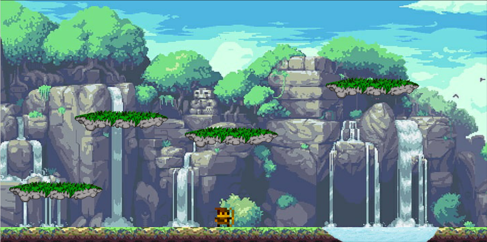

# Playground
Simple 2D Unity platformer project for classes purpose

# Movement
```
A/left arrow - left
D/right arrow - right
Space - jump
S (in midair) - dive down
LShift (hold) - sprint
LCtrl - dash
```

# Description
```
- Player flips his sprite to the direction he is going to
- Player slides off the walls
- Water restarst scene when triggered
- 1st platform works like a trampoline
- 2nd platform rotates during collision
- 3rd platform moves from side to side and can carry the player
- 4th platform disappears 1 second after collision
```

# Scripts
1. [Player Movement](Playground/Assets/Scripts/PlayerMovement.cs)
2. [Platform Disappearing](Playground/Assets/Scripts/PlatformDisappearing.cs)
3. [Platform Movement](Playground/Assets/Scripts/PlatformMovement.cs)
4. [Rigidbody Carry](Playground/Assets/Scripts/RigidbodyCarry.cs)
5. [Reset Scene](Playground/Assets/Scripts/Water.cs)

# Screenshots

